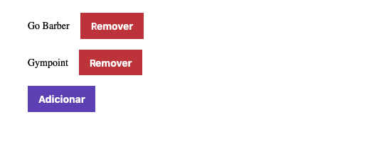

<h1 align="center">
    
</h1>

<h3 align="center">
  Desafio sobre Conceitos de React JS aplicado no Bootcamp GoStack
</h3>

<p align="center">
  <a href="#rocket-sobre-a-aplicação">Sobre a Aplicação</a>&nbsp;&nbsp;&nbsp;|&nbsp;&nbsp;&nbsp;
  <a href="#conteúdo-abordado">Conteúdo Abordado</a>&nbsp;&nbsp;&nbsp;|&nbsp;&nbsp;&nbsp;
  <a href="#instalação">Instalação</a>&nbsp;&nbsp;&nbsp;|&nbsp;&nbsp;&nbsp;
  <a href="#executando-a-aplicação">Executando a Aplicação</a>&nbsp;&nbsp;&nbsp;|&nbsp;&nbsp;&nbsp;
  <a href="#executando-os-testes-da-aplicação">Executando os Testes da Aplicação</a>&nbsp;&nbsp;&nbsp;|&nbsp;&nbsp;&nbsp;
  <a href="#tela-da-aplicação">Tela da Aplicação</a>&nbsp;&nbsp;&nbsp;|&nbsp;&nbsp;&nbsp;
  <a href="#memo-licença">Licença</a>
</p>

## :rocket: Sobre a Aplicação

Esse é o front-end da aplicação para armazenar repositórios do seu portfólio, que irá permitir a criação, listagem e remoção dos repositórios feito com a biblioteca React JS.

## Conteúdo Abordado

- Conceitos ReactJS;
- Configurando Babel;
- Configurando Webpack;
- Componentização;
- Propriedades;
- Estado e Imutabilidade;
- Importando CSS e imagens;
- Listando Projetos da API;
- Cadastrando Projetos.

## Instalação

Instalação das dependências do projeto.

```sh
# Com NPM
npm install

# Com Yarn
yarn
```

## Executando a Aplicação

```sh
# Com NPM
npm run start

# Com Yarn
yarn start
```

## Executando os Testes da Aplicação

```sh
# Com NPM
npm run test

# Com Yarn
yarn test
```

## Tela da Aplicação



## :memo: Licença

Esse projeto está sob a licença MIT. Veja o arquivo [LICENSE](LICENSE.md) para mais detalhes.
